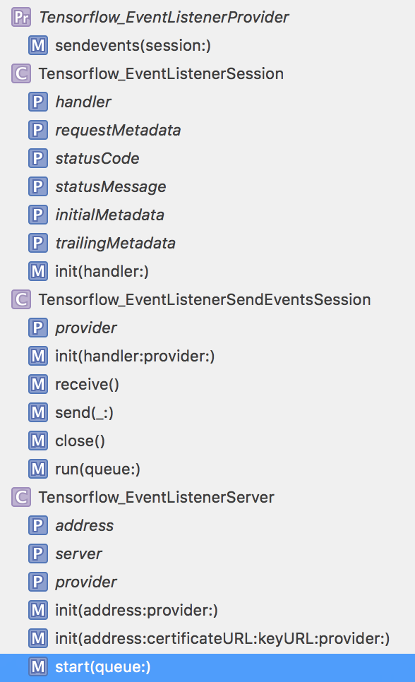
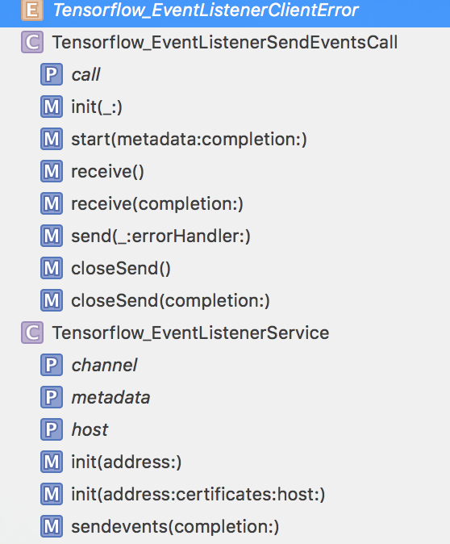
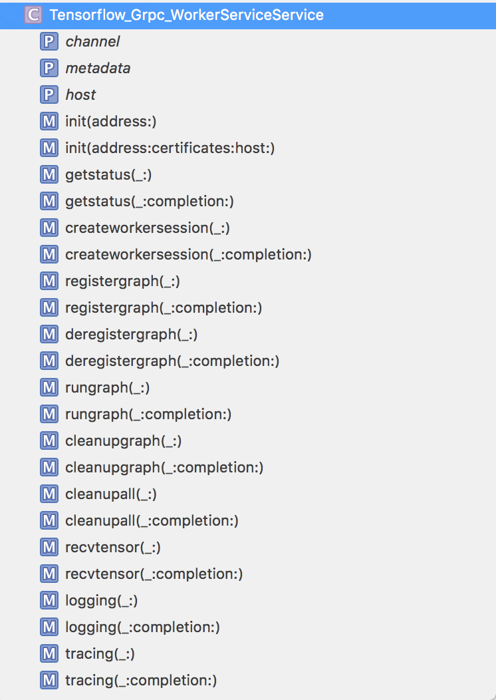
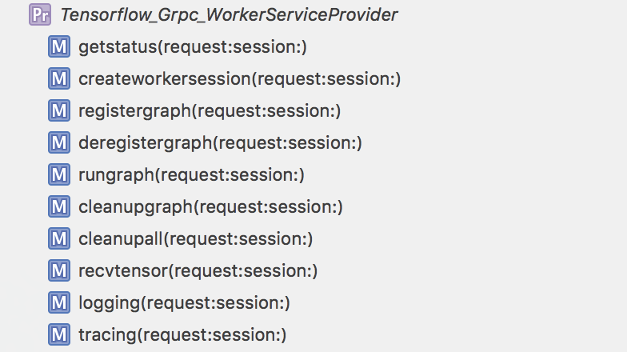
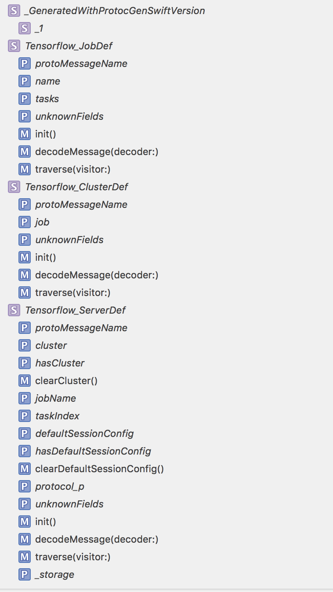

#  🚀 swift-tensorflow    

[Tensorflow](https://www.tensorflow.org) data structures generated from   
[protobuf definitions](https://github.com/tensorflow/tensorflow/tree/master/tensorflow/core/framework) using [swift-protobuf](https://github.com/apple/swift-protobuf) &    
 swift-tensorflow  [Tensorflow](https://www.tensorflow.org) data structures generated from   
[protobuf definitions](https://github.com/tensorflow/tensorflow/tree/master/tensorflow/core/framework)  
 using [swift-protobuf](https://github.com/apple/swift-protobuf) &     using [swift-grpc-protobuf](https://github.com/grpc/grpc-swift)   

RUNME.sh will auto download latest tensorflow / swift grpc and build protobuf files en masse. 

* [Tensorflow Client Service](Sources/tensorflow.client.pb.swift)    
* [Tensorflow GRPC Client Service](Sources/tensorflow.grpc.client.pb.swift)    
* [Tensorflow GRPC Server Service](Sources/tensorflow.grpc.server.pb.swift)    
* [Tensorflow Server](Sources/tensorflow.server.pb.swift)    

    
    
   
    
   
    
   

